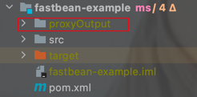
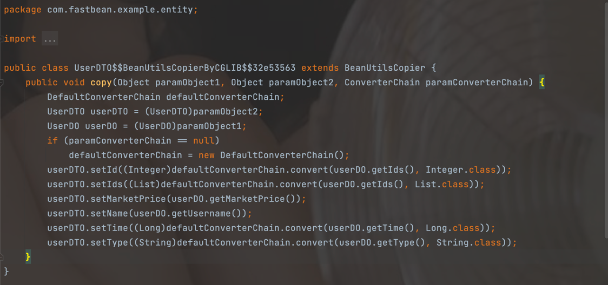

# fastbean

#### 介绍
> fastbean基于cglib。一个快速的基于字节码的映射，它不依赖反射来操作Bean。
> 
> 默认支持同名同类型(含包装类)属性赋值,不同名需要设置nameMapping，字段忽略需要设置ignoreSet，
> 类型不同需要设置类型转换链(默认set NULL)。
> 详细用法请查看example
## 特点
- 基于字节码技术。
- 属性名映射,属性忽略。

- 支持自定义转换链，当前只支持类型不一致才会调用。
- 泛型安全检查
- 支持基本类型与包装类型之间转换。int <-> Integer
- 优雅的链式调用
```java
BeanCopyUtil.chain(userDO,userDTO) // 开启链式调用
        .nameMapping(UserDTO::getName, UserDO::getUsername) // 字段映射（可选）
        .nameMapping(UserDTO::getId, UserDO::getIds) // 字段映射（可选）
        .ignore(UserDTO::getAddress) // 字段忽略(可选
        .converterChain(new DefaultConverterChain()) // 自定义转换器链（可选）
        .converter(new EnumConverter()) // 往转换器(自定义/默认) 添加转换器 （可选）
        .copy(); // 复制
```
## 使用方式
### 查看生成文件
执行fastbean之前执行，查看cglib生成的代理类
```java
System.setProperty(DebuggingClassWriter.DEBUG_LOCATION_PROPERTY, "./proxyOutput");
```


### maven
```xml
<dependency>
    <groupId>io.github.cqpsjsl</groupId>
    <artifactId>fastbean</artifactId>
    <version>2.0</version>
</dependency>

```
> UserDO

```java
@Data
public class UserDO {
    private Integer id;
    private String username;
    private String address;
    private List<Long> ids;
    private Double price;
    private BigDecimal marketPrice;
    private LocalDateTime time;
}
```
> UserDTO

```java
@Data
public class UserDTO {
    private Integer id;
    private String name;
    private String address;
    private List<Long> ids;
    private Double price;
    private BigDecimal marketPrice;
    private Long time;
}
```
 ### 常规使用
 ```java
BeanCopyUtil.copy(userDO, userDTO);
```
### List
```java
List<UserDTO> userDTOS = BeanCopyUtil.copyList(list, UserDO.class, UserDTO.class);
```
### 属性映射、属性忽略
> UserDO中username需要赋值到UserDTO中的name上。
```java
// 属性映射
BeanCopyUtil.chain(userDO,userDTO)
        .nameMapping(UserDTO::getName, UserDO::getUsername)
        .copy();

```
### 自定义转换器
> UserDO中是LocalDateTime,UserDO中是Long,如果未定义属性转换器,将会set NULL。

```java
    BeanCopyUtil.chain(userDO,userDTO)
    .converter(new EnumConverter())
    .copy();

```
> TypeConverter

```java
public class TypeConverter
    implements Converter
{
    public Object convert(Object value, Class target) {
        if (value == null) return null; 
        if (value.getClass().equals(LocalDateTime.class) && target.equals(Long.class)) {
            // 返回你需要的处理
            return Long.valueOf(System.currentTimeMillis());
        }
        return null;
    }
}
```
# 性能比较
> 基于spring stopWatch 进行性能比较，mapstruct肯定比不过。

